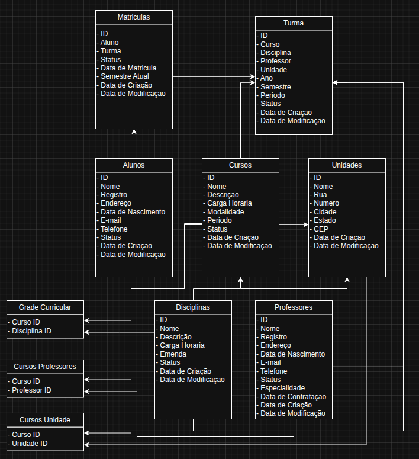

# Student Manager API

## Description

**Student Manager** is a RESTful API for managing an educational institution, such as a college or university. The project is in its initial development phase, and its ultimate goal is to implement all the functionalities represented in the entity-relationship diagram, including the management of students, courses, professors, classes, and enrollments.

Currently, the API features a complete CRUD for the **Students** entity.

## Current Features

- **Student Management:**
    - ✔️ Create a new student.
    - ✔️ Fetch all registered students.
    - ✔️ Fetch a specific student by email.
    - ✔️ Fetch a specific student by register number.
    - ✔️ Edit an existing student's data.
    - ✔️ Delete a student (soft delete, changing the status to `INACTIVE`).

## Roadmap (Next Steps)

The goal is to expand the API to include the management of the following entities, as shown in the diagram below:

- [ ] Courses
- [ ] Professors
- [ ] Disciplines
- [ ] Units (Campus)
- [ ] Classes (Turmas)
- [ ] Enrollments (Matrículas)

## 📊 Entity-Relationship Diagram (ERD)

This is the data model that serves as a guide for the project's development:



## Technologies Used

This project is built using the following technologies:

- **Backend:**
    - [Java 17](https://www.oracle.com/java/technologies/javase/jdk17-archive-downloads.html)
    - [Spring Boot 3](https://spring.io/projects/spring-boot)
    - [Spring Web](https://docs.spring.io/spring-framework/reference/web/webmvc.html)
    - [Spring Data JPA](https://www.google.com/search?q=https://spring.io/projects/spring-data-jpa)
    - [Lombok](https://projectlombok.org/)
- **Database:**
    - [PostgreSQL](https://www.postgresql.org/)
    - [Flyway](https://flywaydb.org/) (for database schema versioning)
- **Build and Management:**
    - [Apache Maven](https://maven.apache.org/)

## How to Run the Project

Follow the steps below to run the application locally.

### Prerequisites

- **Java Development Kit (JDK) 17** or higher.
- **Apache Maven** 3.9 or higher.
- A running instance of **PostgreSQL**.

### Steps

1.  **Clone the repository:**

    ```bash
    git clone <YOUR_REPOSITORY_URL>
    cd StudentManager-API
    ```

2.  **Configure the Database:**
    The application uses environment variables to configure the database connection. You can either:

    - Create a `.env` file in the project root.
    - Or set the variables directly in your operating system.

    The `application.properties` file expects the following variables:

    ```properties
    DATABASE_URL=jdbc:postgresql://localhost:5432/your_db
    DATABASE_USERNAME=your_username
    DATABASE_PASSWORD=your_password
    ```

    *Don't forget to create the database in your PostgreSQL instance before starting the application.*

3.  **Run the application:**
    Use the Maven Wrapper included in the project to ensure compatibility.

    ```bash
    # For Linux/macOS
    ./mvnw spring-boot:run

    # For Windows
    ./mvnw.cmd spring-boot:run
    ```

    The API will be available at `http://localhost:8080`.

## Project Structure

The project follows a standard structure for Spring Boot applications, dividing responsibilities into packages:

```
com.StudentManager.StudentManager
├── Controller/  # Presentation layer (REST Endpoints)
├── DTO/         # Data Transfer Objects (Request/Response)
├── Mapper/      # Mapping classes between DTOs and Entities
├── Model/       # JPA Entities and Enums
├── Repository/  # Spring Data JPA interfaces
└── Service/     # Business logic layer
```

## API Endpoints

Below are the currently available endpoints for the `/students` entity.

-----

#### `GET /students`

Returns a list of all registered students.

#### `GET /students/email/{email}`

Returns a specific student based on their `email`.

#### `GET /students/registerNumber/{registerNumber}`

Returns a specific student based on their `registerNumber`.

#### `POST /students`

Creates a new student.

- **Body (example):**
  ```json
  {
    "name": "John Doe",
    "registerNumber": 123456,
    "address": "123 Flower Street",
    "birthDate": "2000-01-15",
    "email": "john.doe@example.com",
    "phoneNumber": 11987654321,
    "status": "ACTIVE"
  }
  ```

#### `PUT /students/{id}`

Updates an existing student's data.

- **Body (example):**
  ```json
  {
    "address": "456 Main Avenue",
    "phoneNumber": 11999998888
  }
  ```

#### `DELETE /students/{id}`

Performs a soft delete of a student, changing their status to `INACTIVE`.